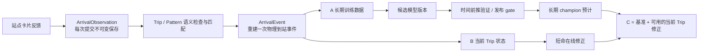

# 到站反馈如何进入长期模型与当前班次修正

日期：2026-08-09
范围：Wayfinder「确定今日服务的数据真值与实时降级模型」中的 Q17–Q19；比较长期批处理、当前班次在线修正和两层组合，并说明在不建立身份信誉或设备去重的前提下，反馈聚合仍然必须承担什么工作。

## 结论

建议把最终形态定为**两层组合 C，但分阶段交付：先上线 A，收集足够的已匹配到站事件后，再让 B 进入 shadow；B 通过回放与在线 shadow gate 后才叠加到乘客 ETA。**

- **A：长期基准层**学习可重复的结构：某条路线在某一时段、教学日类型和 `weekOfTerm` 通常慢多少。它定期训练、验证后发布，不会因为一条反馈立刻变化。
- **B：当前 Trip 在线层**只估计正在运行的某一班车此刻比长期基准早或晚多少。它由反馈触发算法，但结果短命、可撤销、过期即回退；它不改写长期参数。
- **C：两层组合**的乘客预测是 `长期基准 + 当前 Trip 修正`。同一条原始反馈可以分别服务两条管道，但在线输出绝不能直接写回长期模型。

这也解开 Q18：是否修正当前车次，不应成为长期模型的一个开关。它是一个独立的在线状态层；没有可靠 Trip 匹配或在线层过期时，页面自然退回长期「预计」值。

历史上最接近的 Tiramisu 众包公交系统也是两层：每 30 秒用最近 30 秒内仍有 GPS 轨迹的车辆生成实时预测，同时每天用过去一个月的完整行程重建历史模型；两层在拟合前都清理异常记录。它的实时输入是带 trip identifier 的连续 GPS trace，不是本项目的一次到站点击，所以只能支持“分层”的方向，不能证明单点匿名反馈已经足以实时更新。[Tiramisu field trial, pp. 4–5](https://www.cmu.edu/traffic21/pdfs/zimmermanetalchi2011.pdf)

## 用户提交与隐藏上下文

用户看到的交互可以维持非常简单：

```text
2 号线 · 邵逸夫堂
下一班还有 3 分钟
如果时间不准，请反馈

[反馈]
路线：2 号线       （预填，可改）
车站：邵逸夫堂     （GPS 推荐，可改）
到站时间：现在      （预填，可改）
```

卡片同时提交一组用户不必理解的上下文：

| 字段                            | 用途                                                                                |
| ------------------------------- | ----------------------------------------------------------------------------------- |
| `projectionId`                  | 指明用户当时看见的是哪一条预计，便于复现“为什么卡片当时显示这个时间”                |
| `candidateTripId`               | 卡片当时认为“下一班”对应的计划班次，例如 2026-09-07 的 Route 2、官方起点 18:00 发车 |
| `candidatePatternRevisionId`    | 该班次使用的有序站序/方向版本；同一个路线号码可能有不同站序                         |
| `baselineModelVersionId`        | 当时生成预计所用的长期模型版本                                                      |
| `clientObservedAt`/`receivedAt` | 区分用户填写的到站时刻和服务器收到表单的时刻                                        |
| 可选 GPS 证据                   | 只用于推荐和记录距最终选择车站的距离/精度；GPS 自动选择不覆盖用户最终确认的站点     |

`candidateTripId` 不是车牌或实车身份，只是“某服务日某个官方发车时刻形成的一次计划运行”。`RoutePattern` 不是路线号码，而是这次运行实际采用的有序停站版本。GTFS Realtime 同样要求实时更新绑定到一个具体 trip；当 `trip_id` 不足以唯一识别时，需要 `start_time + start_date`，或用 `route_id + direction_id + start_time + start_date` 唯一解析。[GTFS Trip Updates](https://gtfs.org/documentation/realtime/feed-entities/trip-updates/)

隐藏上下文只是**候选**，不是不可变真值。如果用户改了路线、车站或时间，服务端必须重新匹配；如果严重延误导致两班车都合理，就保留 `ambiguous`，不能为方便训练强行挑最近一班。第一阶段暂不处理加班车，只表示“无法匹配到已计划 Trip”，不把它自动解释成加班车。

## 共享数据流



三个层级必须分开：

1. `ArrivalObservation`：一次表单提交。全部保存，包括最终未进入模型的记录。
2. `ArrivalEvent`：同一 `RoutePattern × Stop × Trip × 相近到站时刻` 的若干提交重建出的一个物理事件。
3. `TrainingExample`：满足相应模型 gate 的 ArrivalEvent。A 和 B 可以使用不同 gate。

这不是身份信誉，也不要求匿名设备 ID。它解决的是“数据库有十行”不等于“现实发生了十次到站”。把对同一次到站的重复测量当作十个独立实验属于非独立重复造成的伪重复；统计推断的独立单位应是物理到站事件。[Hurlbert 1984](https://esajournals.onlinelibrary.wiley.com/doi/10.2307/1942661)

## 三种架构的工程与统计比较

| 维度           | A：定期长期模型                                  | B：反馈触发的当前 Trip 修正                                                            | C：两层组合                          |
| -------------- | ------------------------------------------------ | -------------------------------------------------------------------------------------- | ------------------------------------ |
| 回答的问题     | “这条线在这种时段/学期周通常晚多少？”            | “这一班车现在比基准晚多少？”                                                           | 同时回答“通常如何”和“这一班如何”     |
| 乘客可见延迟   | 下一次模型发布；通常是次日或更晚                 | 事件聚合和匹配完成后约几十秒；随后不断过期                                             | 有在线证据时用 B，否则立即回退 A     |
| 所需输入       | 跨多个 Trip、服务日、时段和学期周的 ArrivalEvent | 能唯一匹配到当前 Trip 的新鲜事件；要评估下游预测，还需同 Trip 后续站的真实到站         | A 与 B 的并集                        |
| 可学习内容     | 高峰、星期/教学日、`weekOfTerm`、长期漂移        | 起点晚发、这班车当前拥堵或停站造成的 trip-specific residual                            | 长期结构 + 当前残差                  |
| 不能识别的内容 | 某一辆正在运行的车刚刚遇到的偶发延误             | 仅凭一次点击不能区分残差来自起点晚发、某一区段拥堵还是停站；也不能稳定学习一整月的结构 | 仍受单点反馈和 Trip 匹配限制         |
| 统计稳定性     | 较高；能按服务日时间前推验证                     | 较低；每班数据很少，必须向长期先验收缩并设置过期                                       | 最好，但必须分别评估两层             |
| 工程状态       | 批任务、不可变模型版本、champion 指针            | 每个 Trip 的短生命周期状态、版本化增量、stale/closed/conflicted、客户端刷新            | 两套状态机 + 合成规则 + 双层可观测性 |
| 失败时行为     | 保留上一个 champion                              | 关闭/过期 overlay，回退到 A                                                            | 单层失败不拖垮另一层                 |
| 首版风险       | 学得慢，但不容易因匿名单击误导当前乘客           | 错配 Trip、重复点击或单个错误时刻可能立刻影响下游用户                                  | 复杂度最大，但隔离后风险可控         |
| 适合当前阶段   | **是**                                           | **只适合 shadow**                                                                      | **目标架构，不宜一步上线**           |

BusTime 的原始研究同时比较准确率、训练和推理成本，而不是假设更复杂模型一定更适合部署。在其 4,311 个 Dublin GPS trips 的实验中，简单 delay model 训练成本最低；LSTM 需要大量数据、超参数专家与更高性能硬件；只在 stop 层插值而不是密集距离点插值，训练/推理计算最多减少约 5 倍。具体秒数不能外推到 CUHK，但足以支持先以 stop/event 为统计单位、用简单模型建立可审计基线，再让复杂方法以 challenger 证明价值。[BusTime paper](https://arxiv.org/abs/2003.10373)

### 工程量与日历时间

以下是基于当前 CUpedia 代码的**规划估算**，不是文献结论：假设一名熟悉 Next.js/PostgreSQL 的工程师，并有统计评审；包含后端、模型、测试和最小运维面板，不含完整视觉打磨或人工跟车。当前项目只有 PostgreSQL，没有现成 cron、队列、流处理或实时推送依赖（见 [`package.json`](../../../package.json)），因此 B 的成本主要不是算法算力，而是新增运行状态与正确性边界。

| 工作包                                                              | 主动工程时间 | 等待真实数据的日历 gate                                                       |
| ------------------------------------------------------------------- | ------------ | ----------------------------------------------------------------------------- |
| 共享基础：反馈 API/表、卡片上下文、Trip/Pattern 匹配、事件审核查询  | 2–3 人周     | 可立即开始；需要若干真实服务日验证填写和匹配                                  |
| A：事件终结、定期训练、时间前推评估、模型版本/发布/回滚             | 再 2–3 人周  | 高峰/非高峰至少跨多个服务日；要评估开学后首月曲线，天然需要覆盖前四周及后续周 |
| B：在线事件窗口、Trip 状态、下游投影、过期/冲突、轮询或推送、shadow | 再 3–5 人周  | 需要“某站反馈后、下游站实际何时到”的成对真值；建议至少完整 shadow 两个服务周  |
| C：合成优先级、双层监控、kill switch、端到端降级测试                | 再 1–2 人周  | 依赖 B 先通过 shadow gate                                                     |

因此：只交付可学习的 A，大约 4–6 人周；让 B 也达到可上线质量，大约累计 8–13 人周。**统计结论会比代码更晚成熟**：四周只够观察开学首月，不足以证明跨学期泛化。若有两人并行，日历时间不会线性减半，因为数据覆盖和 shadow 观察不能靠人力压缩。

这些范围最大的未知项是 ordered RoutePattern 和逐日 Trip 是否已被审核；如果它们不可靠，反馈与车次都无法稳定对应，A/B 的时间都要增加。Kafka 的 event-time window/grace 文档可作为迟到事件语义参考，但当前校园规模没有证据需要引入 Kafka；PostgreSQL 加一个幂等定时任务和短周期轮询就足以做 pilot。[Kafka Streams window/grace](https://kafka.apache.org/28/streams/developer-guide/dsl-api/)

## A：定期长期模型

### 运行节奏

把“检查、训练、发布”拆开：

1. 每天服务结束后，按 `observedAt` 归属服务日，等待迟到事件 grace period，终结可终结的 ArrivalEvent。
2. 每天运行数据质量与漂移检查。
3. 只有存在新的 finalized events 且达到重训条件时才创建候选；pilot 可每日检查、每周或数据增量达阈值时训练，避免大量完全相同候选。
4. 候选按时间顺序在未来服务日验证；通过才切换 champion。重训频率不等于发布频率。

时间有序数据不能用随机 K-fold 把未来泄漏进训练。`TimeSeriesSplit` 官方说明正是用先前数据训练、后续数据评估，并指出普通交叉验证在此不适用。[scikit-learn TimeSeriesSplit](https://scikit-learn.org/stable/modules/generated/sklearn.model_selection.TimeSeriesSplit.html)

### 模型与目标

A 以一个 ArrivalEvent 为一条独立训练单位，目标为：

```text
residual = observedArrivalAt - coldStartPredictedArrivalAt
```

首版用已有研究建议的层级稳健 P50：

```text
pattern × stop 基准
+ time band
+ weekday / teaching-day
+ weekOfTerm
```

局部数据不足就回退到更粗层级。中位数对极端观测比均值更稳健；这不代表可以省掉事件匹配，只是降低少量异常值的影响。[NIST robust median](https://www.nist.gov/publications/possible-advantages-robust-evaluation-comparisons)

### 状态、发布与回滚

```text
ArrivalEvent: provisional → finalized | ambiguous | quarantined
ModelVersion: candidate → validation_passed → champion → retired
                            ↘ validation_failed
```

每个模型版本记录训练事件集合/快照哈希、代码与参数、训练窗口、特征、分组指标、生成时间和父版本。发布只原子切换 `championModelVersionId`；回滚把指针指回旧版本，不覆盖模型文件或历史预测。MLflow 官方 registry 的 model version 与可重指 `champion` alias 展示了同一发布模式；本项目不必因此引入 MLflow，也可在 Postgres 实现最小版本表。[MLflow Model Registry workflow](https://www.mlflow.org/docs/latest/ml/model-registry/workflow/)

### 评估

至少同时报告：

- P50 MAE：主指标；
- 绝对误差 P90：防止总体改善、坏情况恶化；
- P10–P90 实际覆盖率：检查内部不确定性是否校准；
- 预测覆盖率：不能靠不预测难例获得更好 MAE；
- 分片：RoutePattern、stop、早晚高峰、教学日、`weekOfTerm=1..4` 与后续周；
- 以服务日为单位的 paired champion/challenger 差异。

### A 的数据 gate

来源没有给出可跨系统照搬的固定 `N`。建议采用以下**首轮工程 gate**：

1. 发布某个局部修正前，至少覆盖 20 个 ArrivalEvent、5 个不同服务日，且单日权重不超过 40%；不足仍显示冷启动预计，只不采用该局部修正。
2. `weekOfTerm` 只有覆盖至少 6 个不同学期周才允许形成独立曲线；此前向无学期周修正收缩。
3. 候选在连续 3 个未来窗口胜过 champion，且高峰、开学首月和主要 Pattern 没有越过预设退化预算才发布。
4. 数字在 pilot 后根据误差收敛曲线重定；不能把原始点击数当成 `N`。

## B：反馈触发、算法计算后的当前 Trip 修正

### 最小可解释算法

B 不需要先上神经网络。对唯一匹配的当前 Trip，在站 `s` 形成一个 provisional ArrivalEvent 后：

```text
rawTripResidual = eventArrivalAt - longTermPrediction(trip, stop)
onlineResidual  = shrinkAndBound(rawTripResidual, measurementUncertainty)
downstreamETA   = longTermPrediction(trip, downstreamStop) + onlineResidual
```

这仍然是“算法计算后更新”，不是把用户填写的 6:05 直接写到页面。`shrinkAndBound` 让一条不确定观测向 0（长期基准）收缩，并限制一次更新的最大影响；参数必须由 matched trips 的历史残差估计。得到同一 Trip 的第二、第三个站事件后，可以再使用状态空间/Kalman 类更新，但若只有一个点，它并不会凭空提供路线轨迹。

GTFS Realtime 的语义允许把某站的已知 delay 传播给后续站，直到新的 stop update 或 `NO_DATA` 截断；这提供了合理的降级规则，不等于证明校园巴士延误会在每一段保持不变。[GTFS Trip Updates](https://gtfs.org/documentation/realtime/feed-entities/trip-updates/)

### 延迟与状态

```text
TripMatch: candidate → unique | ambiguous | unmatched
ArrivalEvent: provisional → revised → finalized
TripOnlineState: inactive → active → stale → closed
                              ↘ conflicted
```

- 新提交先写原始层，再做服务端匹配和短暂聚合；建议 pilot 以 15–30 秒 debounce 形成第一版修正，而不是请求事务内同步改 ETA。
- 每次修正创建递增 `onlineRevision`，客户端只接受同一 Trip 更高版本，防止请求乱序让旧值覆盖新值。
- 新事件与已有状态严重冲突时进入 `conflicted` 并回退 A，不在两条时间之间随意平均。
- 到站事件晚于窗口关闭后仍进入 A，但不复活已经结束的在线状态。
- 当前 Trip 结束、观测超时或人工 kill switch 时，删除的只是 overlay 指针；A 仍然可用。

若未来把它称为“实时”，运维新鲜度应接近行业消费者预期：GTFS-RT 最佳实践建议 feed 至少 30 秒刷新，Trip Updates/Vehicle Positions 不应老于 90 秒。本项目的众包数据质量弱于车辆 AVL，所以 30/90 秒只能作为刷新/过期上限参考，不能作为真实性认证。[GTFS Realtime Best Practices](https://gtfs.org/documentation/realtime/realtime-best-practices/)

### B 的评估必须模拟在线时间

不能用整段 Trip 完成后的所有反馈去预测前面的时刻。离线 replay 在每个 `asOf` 只暴露当时已经收到且未过期的事件，比较：

- downstream ETA MAE/P90 相对 A 是否改善；
- time-to-first-correction 和有在线修正的 Trip/stop 覆盖率；
- bad-update rate：B 让 ETA 比 A 明显更差的比例；
- 错配率、冲突率、stale 时仍被显示的比例；
- 高峰、非高峰、开学前四周、各 Pattern 分片；
- 一次上游事件对下一站、隔两站、线路末端的改善是否递减。

### B 的数据 gate

B 在下列条件全部满足前只运行 shadow，不影响乘客：

1. ordered Pattern 和当天 Trip 已审核，卡片能携带 candidate context；第一阶段只匹配 scheduled trips。
2. 在人工核验样本上，至少 95% 的在线候选能唯一匹配或正确拒绝为 ambiguous/unmatched。这是初始产品护栏，不是 GTFS 标准。
3. 有覆盖高峰/非高峰的多站同 Trip 真值：上游收到反馈后，至少一个下游站后来也有可核验 ArrivalEvent，否则无法评估“修正后是否更准”。
4. shadow 至少覆盖 10 个服务日和所有主要 Pattern；B 的总体/高峰 MAE 改善，P90 与 bad-update rate 在预设预算内。
5. `onlineResidual` 的收缩、上限和过期时间都能从回放数据校准；没有数据时为 0，即只显示 A。

这些 `95%/10 日` 是 pilot 的安全起点，积累数据后应重估。真正的 gate 是 out-of-time replay 的损失，而非运行了多少天。

## C：两层组合的合成规则

每条乘客 ETA 都携带可解释的 lineage：

```text
base = predict(championLongTermModel, Trip, Stop, serviceDayFeatures)

if currentTripState is active and fresh and non-conflicted:
    display = base + currentTripState.onlineResidual
    source = "长期模型 + 当前班次修正"
else:
    display = base
    source = "预计"
```

在线事件最终关闭后，它作为普通 ArrivalEvent 进入下一次 A 训练，但在线 residual、用户当时看到的预测和 B 的输出不能作为 A 的标签，避免模型用自己的预测训练自己。A 和 B 分别有版本：`baselineModelVersionId` 与 `onlineRevision`；任何展示都能回放。

回滚也分开：

- A 回滚：切回上一个 champion 模型版本；
- B 回滚：关闭某 Trip、某 Pattern 或全局 online overlay；
- C 合成层故障：强制只返回 A，而不是停止提供 ETA。

## 不做身份信誉/设备去重，仍然不可省的处理

用户的产品选择可以精确定义为：**匿名可提交；不建立账号信誉，不生成设备画像；所有提交都作为 ArrivalObservation 保留。**它不等于“每一行都作为独立、等权训练样本”。下列处理不需要知道是谁：

1. **传输幂等**：同一次表单因超时重试不能写出多个 Observation。使用一次性 `submissionId` 只防网络重放，不追踪用户。
2. **引用完整性**：Route/Stop/Pattern 必须存在，Pattern 必须真的服务该 Stop；用户修改字段后重新验证隐藏上下文。
3. **时间一致性**：记录客户端时刻、服务器收到时刻和时区；未来时间、远离当天服务窗口的时间保留但标记 `quarantined`。
4. **Trip 匹配状态**：`unique/ambiguous/unmatched` 是数据，不强制补成 unique。
5. **物理事件聚合**：同 Trip、同 Stop、相近时间的提交形成一个 ArrivalEvent；事件窗口按实际班距和误差分布回测，不能永久硬编码一分钟。
6. **稳健事件时刻**：用聚合内到站时刻的稳健中心和离散度；所有原始值仍可审计。
7. **固定事件权重**：一个 ArrivalEvent 在 A 中最多贡献一个独立样本；20 个点击不能把 `effectiveN` 变成 20。重复证词可描述事件的一致程度，但因匿名提交可能相关，不能按 `1/sqrt(20)` 缩小统计不确定性。
8. **站序约束**：同 Trip 的下游到站不能早于已确认上游到站；冲突进入状态而不是无条件平均。
9. **模型输入隔离**：Observation、Event、TrainingExample、线上 Projection 各自保留身份；页面预测绝不回流成观测标签。

不做任何身份或设备信号会留下一个无法由算法完全消除的限制：系统不能判断大量相似提交来自很多独立乘客还是一个人反复填写。因此点击数不能直接增加模型权重，也不能用“多人同意”作为 B 的唯一放行条件。事件聚合、影响上限、跨站一致性和 shadow gate 能降低后果，但不能提供 Sybil resistance；这是选择匿名无身份后的明确风险，而不是实现 bug。

## 推荐分阶段路线

1. **共享基础与 A**：上线卡片反馈；全部保存 Observation；离线重建 Event；页面继续显示「预计 6:02」；定期候选通过时间前推 gate 才替换长期 champion。
2. **B shadow**：同一事件实时匹配 Trip 并生成内部 online residual，但乘客仍看 A；收集“当时会怎样修、下游后来实际何时到”。
3. **有限 C**：只为通过 gate 的 Pattern 开启在线 overlay；清楚区分「预计」与「根据当前班次修正」，90 秒无新证据即回退。
4. **扩大或退出**：按 Pattern 分别评估。某一线 B 无法胜过 A，不妨永久只用 A；两层组合不要求全网同时开启。

这条路线同时保留用户提出的低摩擦交互和长期拟合目标，又避免把“反馈立即触发算法”误解成“反馈直接改时刻”。

## 来源与证据边界

### Primary sources / specs / source code

- Zimmerman et al., [Field Trial of Tiramisu: Crowd-Sourcing Bus Arrival Times to Spur Co-Design](https://www.cmu.edu/traffic21/pdfs/zimmermanetalchi2011.pdf), CHI 2011.
- Liu, Sun & Wang, [BusTime: Which is the Right Prediction Model for My Bus Arrival Time?](https://arxiv.org/abs/2003.10373), 2020; [associated source code](https://github.com/swangcs/BusGPS).
- MobilityData, [GTFS Realtime Trip Updates](https://gtfs.org/documentation/realtime/feed-entities/trip-updates/) and [Realtime Best Practices](https://gtfs.org/documentation/realtime/realtime-best-practices/).
- Apache Kafka, [Streams DSL: window grace and suppression](https://kafka.apache.org/28/streams/developer-guide/dsl-api/).
- scikit-learn, [TimeSeriesSplit](https://scikit-learn.org/stable/modules/generated/sklearn.model_selection.TimeSeriesSplit.html).
- MLflow, [Model Registry workflow and aliases](https://www.mlflow.org/docs/latest/ml/model-registry/workflow/).
- Muller/NIST, [Possible Advantages of a Robust Evaluation of Comparisons](https://www.nist.gov/publications/possible-advantages-robust-evaluation-comparisons), 2000.
- Hurlbert, [Pseudoreplication and the Design of Ecological Field Experiments](https://esajournals.onlinelibrary.wiley.com/doi/10.2307/1942661), 1984.

### 本文的工程推断

- A → B shadow → C 的分阶段顺序，以及 4–6/8–13 人周估算；
- PostgreSQL + 幂等定时任务/短轮询足以进行校园规模 pilot，无需先引入 Kafka；
- 15–30 秒 debounce、`95%` 匹配护栏、10 个 shadow 服务日、20 events/5 days、6 term weeks；
- Observation/Event/TrainingExample 三层 schema、online residual 的收缩/上限、双层 kill switch；
- 不依赖身份的 event aggregation 和固定 event weight。

这些是下一阶段应通过真实 CUHK 反馈回放校准的初始设计，不应包装成文献给出的通用阈值。
