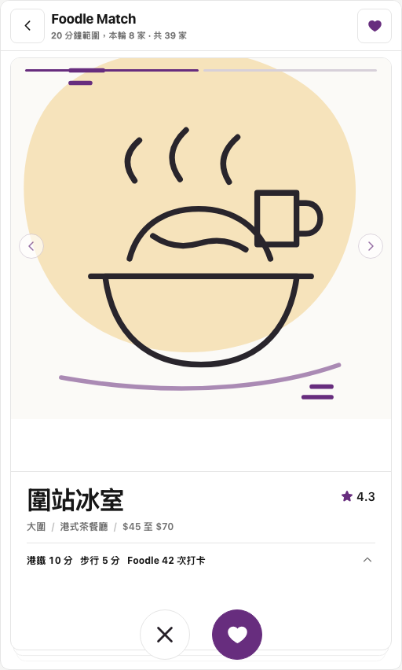
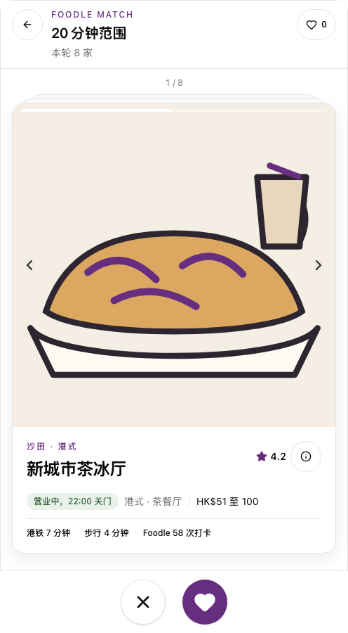
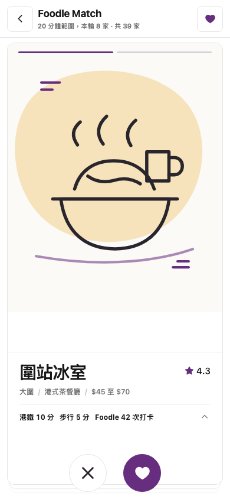
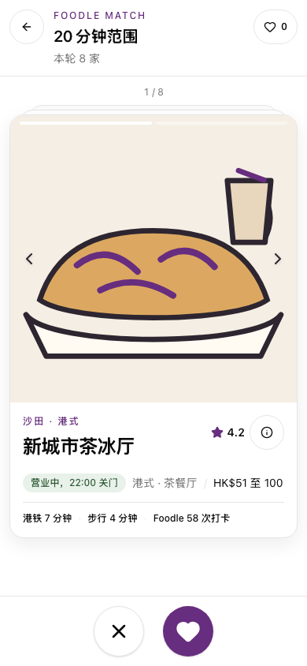

# #500 Foodle discovery visual acceptance

Source of truth: [`foodle-dating-card.html`](../prototypes/foodle-dating-card.html).
The comparison runs both surfaces at the same 20-minute scope with an eight-card
batch.

## Desktop

| Mockup                                                | Implementation                                                        |
| ----------------------------------------------------- | --------------------------------------------------------------------- |
|  |  |

## 390px mobile

| Mockup                                                 | Implementation                                                         |
| ------------------------------------------------------ | ---------------------------------------------------------------------- |
|  |  |

## Intentional MVP differences

- The implementation follows CUpedia's Simplified Chinese locale and existing
  design tokens.
- Restaurant names and facts use the OpenRice-shaped mock catalog rather than
  the prototype's seed records.
- The header shows the active scope and saved count; the card keeps source
  details behind an explicit information control.
- Pairwise comparison and the final Match result belong to #501 and are not
  shown in this discovery-only acceptance snapshot.
