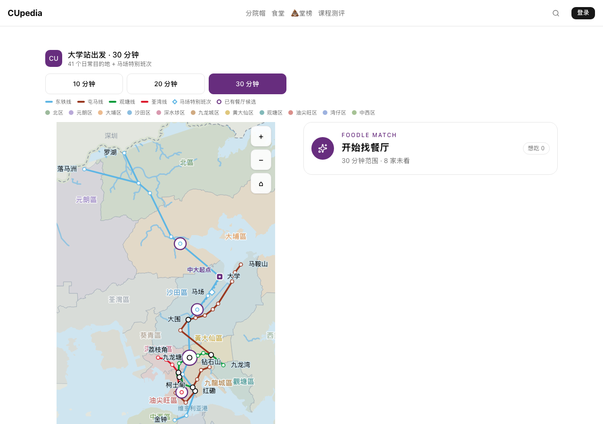
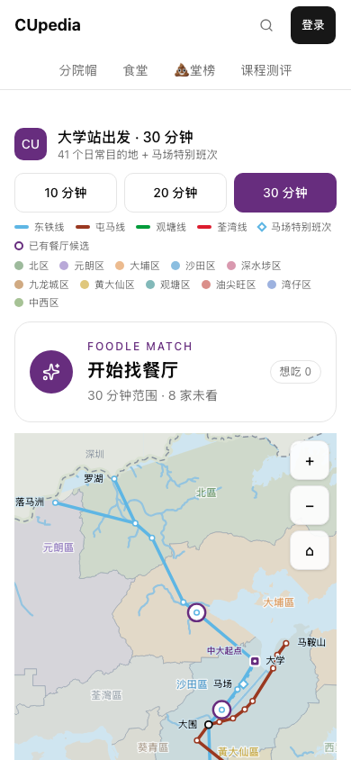
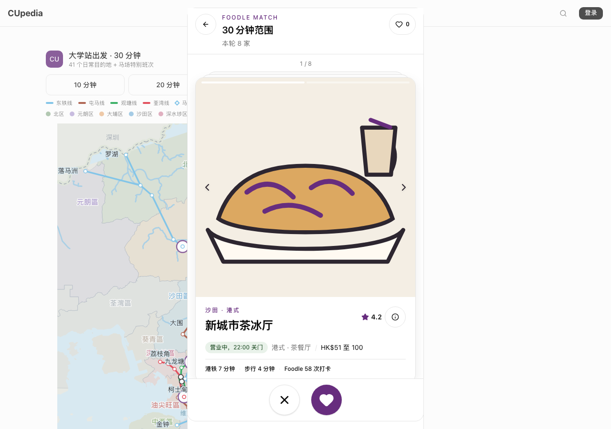
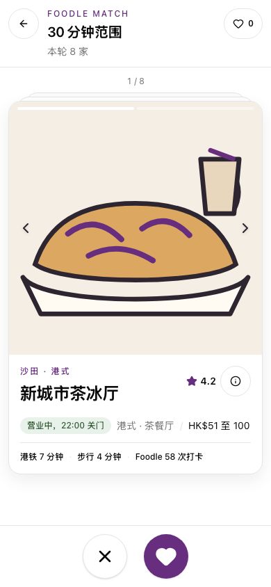
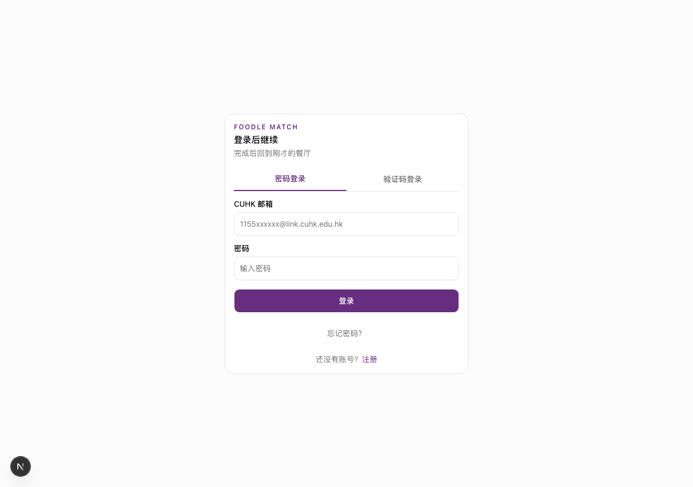
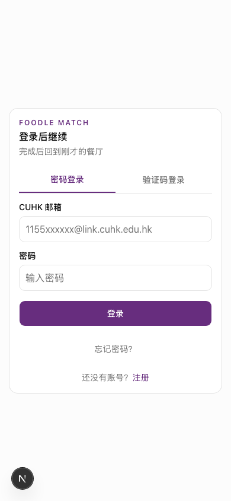

# #502 Foodle production-data visual acceptance

The checked-in prototype
[`docs/prototypes/foodle-dating-card.html`](../prototypes/foodle-dating-card.html)
remains the interaction source of truth. The #500 discovery and #501
comparison/result acceptance records remain the visual baseline; #502 changes
the data and account boundaries without introducing a second Match UI.

Desktop captures are 1280 × 900. Mobile captures are 390 × 844.

## Map context and Match entry

| Desktop                                                                 | 390px                                                                    |
| ----------------------------------------------------------------------- | ------------------------------------------------------------------------ |
|  |  |

The Match module stays independent from the railway schematic. It sits beside
the map on desktop and immediately before the map on mobile, so the entry is
visible without scrolling through the full schematic. Budget and station still
come from the map as a read-only candidate scope.

## Reviewed mockup and production Match

| Reviewed mockup                                                                                                                                                                                                                                              | Production-data Match — desktop                                                | Production-data Match — 390px                                                   |
| ------------------------------------------------------------------------------------------------------------------------------------------------------------------------------------------------------------------------------------------------------------ | ------------------------------------------------------------------------------ | ------------------------------------------------------------------------------- |
| [Discovery desktop](screenshots/500-mockup-desktop.png), [discovery 390px](screenshots/500-mockup-mobile-390.png), [comparison desktop](screenshots/501-mockup-comparison-desktop.png), [comparison 390px](screenshots/501-mockup-comparison-mobile-390.png) |  |  |

The production surface reuses the approved header, line-art fallback, card
geometry, fact hierarchy, 64px decision controls and single purple action
color. Desktop keeps the same narrow dating-card column; its fixed action bar
now closes inside that sheet instead of touching the viewport edge.

## Authentication interruption

| Desktop                                                                             | 390px                                                                                |
| ----------------------------------------------------------------------------------- | ------------------------------------------------------------------------------------ |
|  |  |

The interruption explains that no decision has been submitted, then returns to
the same restaurant and scope for explicit confirmation. The shared login form
keeps the Foodle label and purple action color only for this return path. Tabs,
inputs and submit controls are at least 44px high on the 390px route.

## Data and state acceptance

- The approved fixture is stored as an OpenRice-shaped JSON snapshot and enters
  the app through one validating importer. Foodle IDs and provider IDs remain
  separate; duplicate, malformed, unsupported-station and unsupported-opening
  rows are rejected explicitly.
- Missing URL, image, cuisine, price, opening and Foodle aggregate fields keep
  an explicit placeholder or line-art fallback. Partial and stale catalogs are
  non-blocking; empty and failed catalogs disable the entry instead of opening
  a zero-candidate dead end.
- Anonymous users may browse facts. The first personal write opens the login
  interruption. Authenticated decisions and the latest completed Match are
  account-scoped and survive refresh and independent browser contexts.
- Existing local records are never merged silently. Migration, local discard
  and local retention are separate explicit actions with visible completion
  feedback.
- Account-state read failure shows “想吃 —”, keeps facts browsable and disables
  personal writes. It is not rendered as an empty account.

## Interaction acceptance

- A real HTTP 390px touch flow covers map entry, restaurant choice, login,
  restored scope/card, explicit reconfirmation, saved candidates, pairwise
  Match, result, refresh and reopening the last result.
- The discovery surface exposes modal semantics, traps Tab/Shift+Tab, closes on
  Escape and restores focus to its map entry. Nested details and Match dialogs
  close independently before the outer surface.
- 320px and 390px comparison geometry, external Google Maps/OpenRice actions,
  dark mode, reduced motion and all three local-state handling paths are
  automated.
- Check-in, “today”, route planning, scraping jobs and model training remain
  outside #502.

## Intentional differences

- The app uses Simplified Chinese and CUpedia tokens while the concept mockup
  contains earlier Traditional Chinese copy.
- The static approved snapshot is the integration boundary for this ticket;
  live scraping and scheduled refresh are separate operational work.
- Missing provider imagery deliberately keeps the reviewed line-art treatment
  rather than fabricating restaurant photography.
